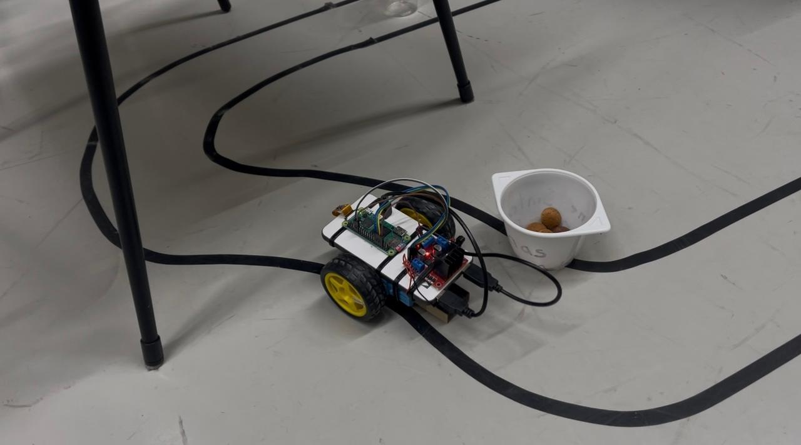
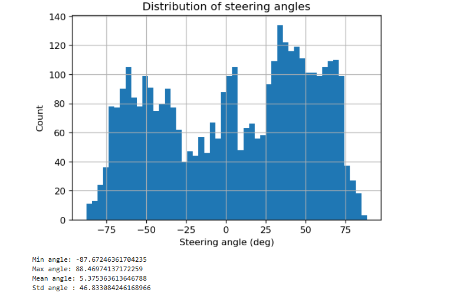
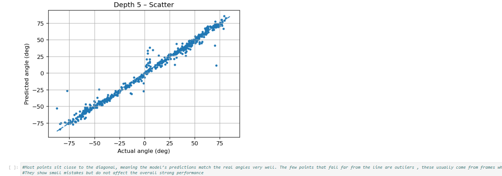

# Autonomous Line-Following Robot (CNN Steering Regression)

A vision-based autonomous robot that follows a track by predicting steering angles directly from camera frames using a CNN regression model.  
This project covers the full pipeline: **data collection → angle labeling → baseline model → final improved model**, with deployment context on **Raspberry Pi**.

---

## 🚀 Key Highlights
- Built an end-to-end ML robotics pipeline: **data collection → labeling → training → evaluation**
- Implemented a **CNN regression model (PilotNet-style)** to predict steering angles
- Collected and labeled a **custom dataset** from real robot runs
- Improved performance from baseline to final model through iterative tuning

---

## 🖼️ Demo & Setup

---

## 🎥 Demo Videos
- ✅ [Obstacle track run](docs/videos/demo_obstacles.mp4)
- ✅ [Sharp turn test](docs/videos/demo_sharp_turn.mp4)
- ✅ [Object following test](docs/videos/demo_object_following.mp4)

---

## 🧠 Problem
Traditional rule-based line followers (thresholding, PID tuning) often fail under lighting variation, sharp curves, and noise.  
The goal of this project was to learn steering behavior directly from visual input for more robust control.

---

## ✅ Solution Approach
1. Collect camera frames while driving the track
2. Compute steering angles as training labels
3. Train a CNN regression model mapping image → steering angle
4. Evaluate, tune, and improve the final model

---

## 📂 Notebooks (pipeline)
- `01_compute_angles.ipynb` → compute / label steering angles
- `02_cnn_regression_baseline.ipynb` → baseline training + evaluation
- `03_final_model_cnn_regression.ipynb` → final model + results

---

## 📊 Results

### Angle distribution (dataset)

### Training vs Validation curve

### Predicted vs Actual steering angle

---

## 🧰 Tech Stack
- Python (Jupyter Notebook)
- PyTorch
- OpenCV / PIL
- Raspberry Pi + PiCamera (deployment context)

---

## 📌 Notes
- Full dataset is not included due to size (available on request).
- Repository focuses on showcasing the full ML pipeline + results.

---

## 👤 Author
**Kejdi Alushaj**  
MSc Next Level Engineering (NLE), The Hague University of Applied Sciences
